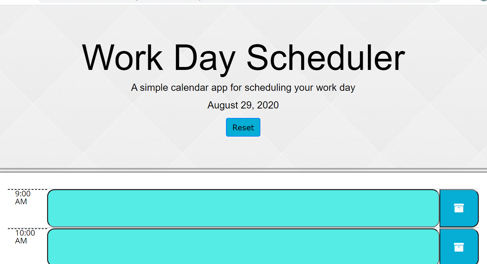
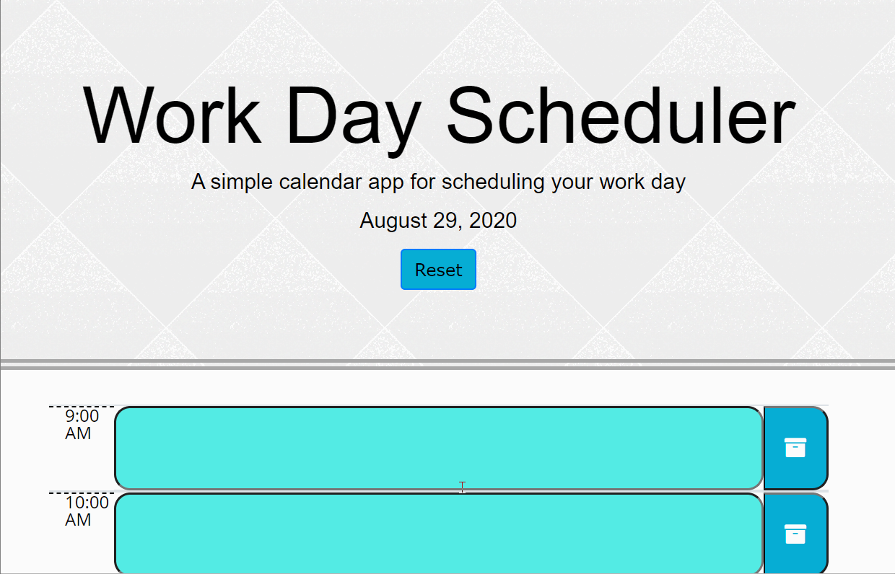

# Daily Scheduler
### A simple daily calendar divided by the hour, conveniently color-coded.
> Stay organized by entering events into this convenient calendar.

*****

## Installation

You can open the deployed website [here](https://haleynmyers.github.io/daily-scheduler/).

If you want to play around with code, you can
clone [this repository](https://github.com/haleynmyers/daily-scheduler) to your terminal and open it in VS Code or equivalent program.

*****

## Usage 

Enter a scheduled event to the corresponding hour on the form provided. Click the blue save button to save that event to your local device, so that even if you refresh your page, the event will be still be there.

For best results, preface your event with the time before saving such as "10:15 Meeting".

*****

## Credits

Base code provided by Trilogy Education Services with the intent to teach and practice code. 

Background image "Stardust" provided by Subtle Patterns (https://www.toptal.com/designers/subtlepatterns/stardust/).
Created by Atle Mo.

Special thanks to my cohorts who helped troubleshoot my code.

## License 
Copyright <2020> <Haley Myers>
The MIT License
Permission is hereby granted, free of charge, to any person obtaining a copy of this software and associated documentation files (the "Software"), to deal in the Software without restriction, including without limitation the rights to use, copy, modify, merge, publish, distribute, sublicense, and/or sell copies of the Software, and to permit persons to whom the Software is furnished to do so, subject to the following conditions:

The above copyright notice and this permission notice shall be included in all copies or substantial portions of the Software.

THE SOFTWARE IS PROVIDED "AS IS", WITHOUT WARRANTY OF ANY KIND, EXPRESS OR IMPLIED, INCLUDING BUT NOT LIMITED TO THE WARRANTIES OF MERCHANTABILITY, FITNESS FOR A PARTICULAR PURPOSE AND NONINFRINGEMENT. IN NO EVENT SHALL THE AUTHORS OR COPYRIGHT HOLDERS BE LIABLE FOR ANY CLAIM, DAMAGES OR OTHER LIABILITY, WHETHER IN AN ACTION OF CONTRACT, TORT OR OTHERWISE, ARISING FROM, OUT OF OR IN CONNECTION WITH THE SOFTWARE OR THE USE OR OTHER DEALINGS IN THE SOFTWARE.
